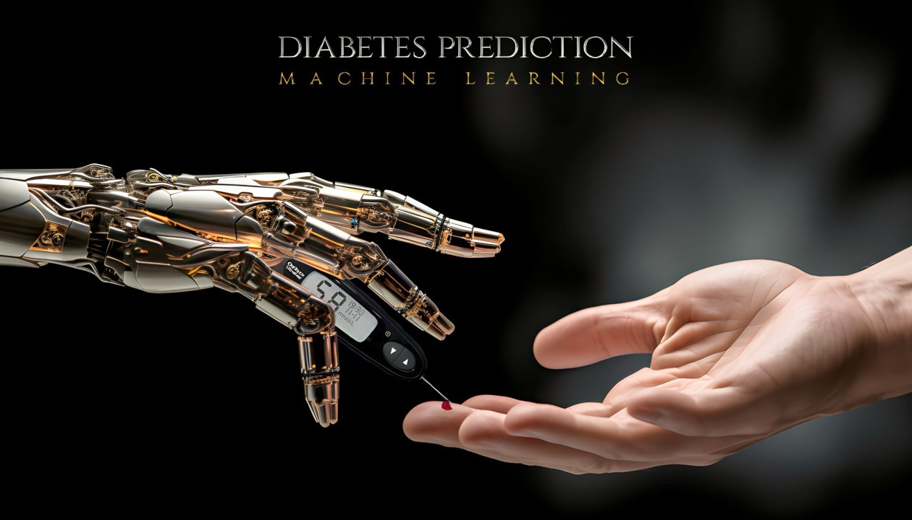

# Project-4: Diabetes Prediction using ML Model

## Collaborators
- Beauty Simora
- Luis Rivera
- Nidhi Ojha
- Preeti Wadhwa
- Steven Miller

## Objective
- The objective of this project is to accurately predict whether or not a patient has diabetes based on certain diagnostic measurements. 
- The dataset used in the project takes several diagnostic factors into consideration. These factors include: 
    - gender
    - blood glucose levels
    - hypertension
    - heart disease
    - smoking history
    - Body Mass Index (BMI)
    - HbA1c level 
    - age
- We will demonstrate how this dataset can be used to build machine learning models to predict diabetes in patients based on their medical history. 
- This model can be useful for healthcare professionals in identifying patients who may be at risk of developing diabetes and in developing personalized treatment plans. 
- Furthermore, the dataset can be used by researchers to explore the relationships between various medical and demographic factors and the likelihood of developing diabetes. 

## Why does this matter?
- To briefly summarize, diabetes is a persistent health condition characterized by impacting the body's ability to convert food into energy. 
- The body breaks down most of the food one consumes into glucose (sugar). The glucose is then released into the bloodstream to provide a constant supply of energy to various tissues and organs. - Insulin acts as a ‘key’ that allows the sugar into one’s body’s cells for the use of energy. 
- Theory suggests the diabetic condition is caused by an autoimmune response (body attacking self) inhibiting the production of insulin. 
- In other words, because insulin production has been negatively affected, the body will struggle to turn glucose into energy.
- As of today, 38 million people have the condition and around 20% of Americans don't know they have it. 
- The problem is also a growing one as diabetes patients have doubled over the last 20 years and has become the 8th leading cause of death in the US. 
- It's also the leading cause of kidney failure, lower-limb amputations, and adult blindness. 
- While there is no substitute for diet and exercise as a preventative measure, further refinement of technology including but certainly not limited to machine learning models, could mean better medical care and better outcomes for patients. 

## Data Set Used
**https://www.kaggle.com/datasets/iammustafatz/diabetes-prediction-dataset**

### About Dataset:

- The Diabetes prediction dataset is based on a collection of medical and demographic data from patients.
- Electronic Health Records (EHRs) are the primary source of data for the Diabetes Prediction dataset. 
- For those who are uninitiated, EHRs are digital versions of patient health records that contain information about their medical history, diagnosis, treatment, medications and outcomes. 
- The data in EHRs is collected and stored by healthcare facilities, such as hospitals and clinics, as part of their routine clinical practice. 
- Using this dataset has a number of advantages. Those advantages include that EHRs contain a large amount of patient data including demographic and clinical information which can be used to develop accurate machine learning models. 
- EHRs also provide a view of a patient's health over time, which can be used to identify patterns and trends in their health status. 
- Because EHRs are widely used in clinical practice, making the Diabetes Prediction dataset relevant to real-world healthcare environments and applications. 

## Prerequisites to run the code

## Steps to run the code

- We  installed dependencies, pyspark, and created a Spark Session for our database. 
- We then cloned the diabetes dataset from the github repository. - Once the dataset was cloned, we were ready to create the data frame. 
- We displayed the dataframe in Google Colab (because it works faster than Jupyter Notebook) and used the .count() function to show how many rows of data there were (100,000). 
- We then used the .printSchema() function to display the attributes of each of the column categories in the dataset. 
- Once we had an idea of the kind of data we had to work with, we now were ready to clean up the data. 
- We noticed there were a number of empty values and uncertain values. For example, for the gender category, there were three possible entries: Female, Male, and Other. 
- To make the data as consistent as possible, we not only removed all null values (blank or N/A spaces) but also the "other" value for gender or cells with "no info" for more desirable results. 
- After checking to see if the necessary values were removed by displaying it, we then had to change the attribute of the "Gender" category. 
- In order to make the output for the Gender entry to be more consistent, we assigned the number 0 for "Female" and 1 for "Male". We also did something similar to the smoking category due to the nuances there. For the "Smoking History," we assigned 0 for "Never", 1 for "Ever", 2 for "Not Current", 3 for "Current", and 4 for "Former." 
- At this point, we were ready for a correlation analysis. Using VectorAssembler, we created our updated categories with cleaner data so we could proceed to split the data for training and testing. The training data developed a prediction rate of over 95%. 